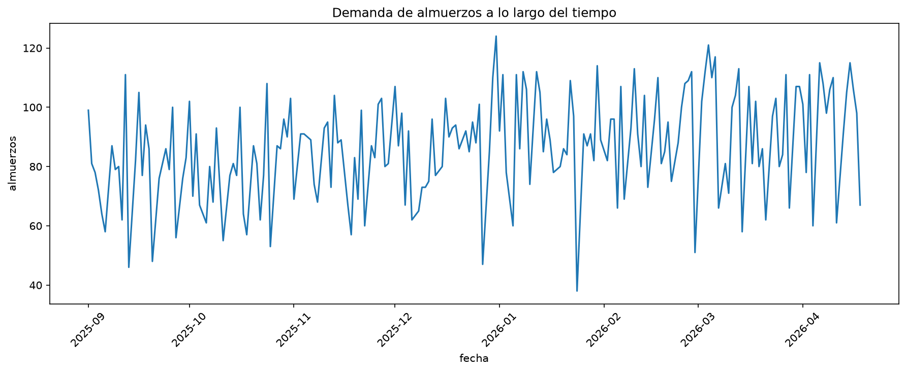

# Taller Semana 3 — Demanda por sede (cadena nacional) 🏢📊

# Integrantes
* Juan Felipe Sanchez
* Nicolas Sotelo
* Zary Velasco

Bienvenido al repositorio del taller. **Empieza leyendo [`ENUNCIADO_TALLER.md`](ENUNCIADO_TALLER.md)** —
ahí está la historia, la misión, el contrato de entrega y la rúbrica.

## Qué hay en este repo

```
demanda-sede-ml/
├── ENUNCIADO_TALLER.md    <- LÉEME PRIMERO
├── data/
│   └── almuerzos_entrenamiento.csv   # tu muestra de datos (una sede)
├── src/
│   └── entrenar.py        # el modelo del "analista junior" — el que vas a auditar
├── requirements.txt
└── README.md              # este archivo
```

## Cómo arrancar / Requisitos

**Versión de Python utilizada:** Python 3.13.14 

```bash
# 1. Entorno virtual
python -m venv .venv
source .venv/bin/activate          # Windows: .venv\Scripts\Activate.ps1

# 2. Dependencias
pip install -r requirements.txt

# 3. Corre el modelo del analista tal como llegó (para ver su "métrica milagrosa")
python src/entrenar.py
```

## Tu trabajo (resumen — el detalle está en el ENUNCIADO)

1. **Audita** el modelo del analista: encuentra por qué su métrica miente.
2. **Reconstruye** un modelo honesto con `Pipeline` + validación temporal.
3. **Implementa el contrato** `python src/predict.py <features.csv> <salida.csv>`.
4. Documenta todo en tu propio README (secciones "Auditoría" y "Nuestro MAE honesto")
   y trabaja con **≥5 commits** que cuenten el proceso.

Al final, el profesor evaluará tu `predict.py` contra un conjunto de datos oculto y
publicará el leaderboard. Éxitos 🚀


# Auditoría

### Fase 1:
**Trampa 1:** Las variables `llovio` e `ingreso_dia` de `entrenar.py` no deben considerarse en el modelo dado que, a las 6 de la mañana el sistema ERP no tiene clara la información, además `ingreso_dia` es una fuga directa porque los ingresos se calculan a partir de la cantidad de almuerzos y su precio, y el modelo podría simplemente despejar la variable para definir la cantidad de almuerzos. Adicionalmente la pista que delata `ingreso_dia` es el comentario que deja en los features el analista junior.

**Trampa 2:** Se realiza el escalamiento antes de separar los datos de entrenamiento y los datos de prueba; primero se está aplicando el `fit_transform` a todas las features y luego si se separan, lo cual es incorrecto.

**Trampa 3:** Se presenta división aleatoria de una serie temporal ya que la función `train_test_split` usa por defecto `Shuffle = TRUE` lo que hace que la información se tome aleatoriamente y que se utilice el futuro para predecir el pasado al momento de probar el modelo.

Las 3 trampas generan que la cantidad de almuerzos estimada se infle

### Fase 2:

- No se consideran en la construción del modelo las variables `llovio` e `ingreso_dia` ya que provocan fuga de datos 

- Se agrega el pipeline y el preprocesamiento de las variables en el archivo `model.py` 

- Se toman 40 días de validación teniendo en cuenta que representa el 20% de los datos de nuestra muestra


## Nuestro MAE honesto

- El MAE obtenido tras los ajustes realizados es de: **10.1 almuerzos** 

### Gráfica:  



En la gráfica se observa que la cantidad de almuerzos diarios varia considerablemente y no hay una relación lineal visualmente evidente. Por lo tanto las features seleccionadas no solo incluyen el tiempo sino que se consideran otras variables como `temperatura` y `precio`  

# Fase 3

Se implementa la siguiente interfaz, para ejecutar el modelo según los datos con fechas futuras para predecir la cantidad de almuerzo que deberían prepararse:

```bash
python src/predict.py <ruta_features.csv> <ruta_salida.csv>
```

Para nuestra prueba, se creó el archivo `test.csv` con las últimas 35 filas del original (`almuerzos_entrenamiento.csv`), y se almacenó en la carpeta `data`. Además, se alojó el resultado de la predicción en el archivo `prediccion.csv` con las columnas `fecha` y `prediccion`, que se encuentra en la carpeta `resultado`.  

Para ello, el comando ejecutado en nuestra prueba fue:  

```bash
python src/predict.py data/test.csv resultado/prediccion.csv
```


# Respuesta MAE final

*Defensa garantizada al final: "¿por qué tu MAE es PEOR que el del analista junior, y por qué eso es una buena noticia para la empresa?"* 

**Respuesta:** El MAE final (10.1 almuerzos) es peor que el de el analista junior, pero representa una buena noticia para la empresa porque considera un rigor y honestidad metodológica para hacer un tratamiento adecuado de los datos, y presentar una estimación más precisa de los almuerzos que deben ser preparados.

Por un lado, no considera las variables `ingreso_dia` y `llovio`, ya que estas generan fuga de datos, al ser información diaria, extraída al final de cada día, que no se tiene al momento de realizar una predicción futura. Sumado a esto, se ajusta la lógica para realizar el escalamiento a los datos de entrenamiento únicamente, y no a los datos de prueba, como lo hacía el analista junior. 

